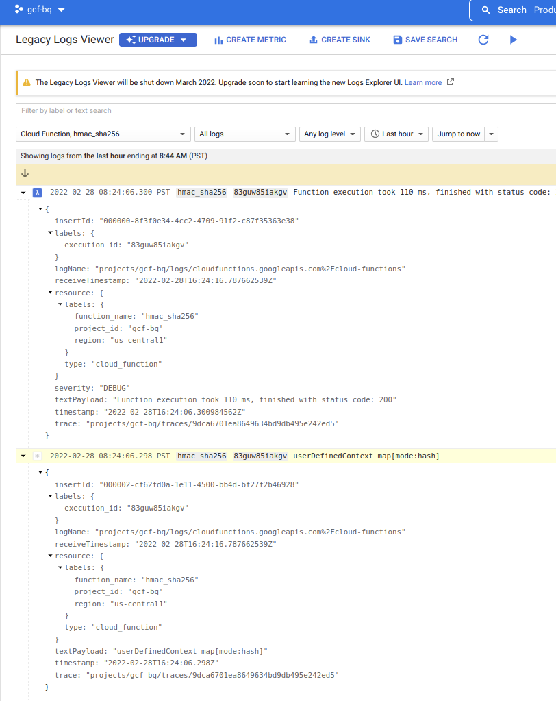

## BigQuery Remote Functions in Go

A [BQ Remote Function](https://cloud.google.com/bigquery/docs/reference/standard-sql/remote-functions) that just does something simple:

* for each row, a [Cloud Function](https://cloud.google.com/functions) will calculate the  [HMAC-SHA256](https://en.wikipedia.org/wiki/HMAC) using a passphrase provided by the function caller.

In this example, the expected base64 encoded value with plaintext and key will be

```bash
export key="key"
export plaintext="The quick brown fox jumps over the lazy dog"
echo -n  "$plaintext" | openssl dgst -sha256 -hmac "$key"  -hex -r | xxd -r -p | base64

97yD9DBThCSxMpjmqm+xQ+9NWaFJRhdZl0edvC0aPNg=
```

>> NOTE: this feature is in private preview (as of 2/28/22); running this tutorial requires allowlist/enablement.

#### Setup

First create the cloud function and test 

```bash
export GCLOUD_USER=`gcloud config get-value core/account`
export PROJECT_ID=`gcloud config get-value core/project`
export PROJECT_NUMBER=`gcloud projects describe $PROJECT_ID --format='value(projectNumber)'`
```

```bash
gcloud functions deploy hmac_sha256 \
  --runtime go116 \
  --entry-point HMAC_SHA256 \
  --region=us-central1 \
  --trigger-http

# Allow unauthenticated invocations of new function [remote_concat]? (y/N)?  N

gcloud functions add-iam-policy-binding hmac_sha256 \
  --member="user:$GCLOUD_USER" \
  --role="roles/cloudfunctions.invoker"
```


Now test directly using curl.  You should see the hmac output in the reply.

Given the input

- `req.json`

```json
{
    "requestId": "124ab1c",
    "caller": "//bigquery.googleapis.com/projects/myproject/jobs/myproject:US.bquxjob_5b4c112c_17961fafeaf",
    "sessionUser": "test-user@test-company.com",
    "userDefinedContext": {
     "key1": "value1",
     "key2": "v2"
    },
    "calls": [
     ["The quick brown fox jumps over the lazy dog", "key"],
     ["The quick brown fox jumps over the lazy dog", "bar"],
     ["foo", "bar"],
     ["bar", "bar"],
     ["foo", "bar"],     
     ["The quick brown fox jumps over the lazy dog", "key"],
     ["The quick brown fox jumps over the lazy dog", "bar"]
    ]
}
```

the output will be in order (i.,e we expect the hashes of (row1, row6) to match as well as (row2, row7) and finally (row3, row5))

```bash
curl -s  -X POST  \
  -H "Authorization: Bearer `gcloud auth print-identity-token`" \
  -H "Content-Type: application/json"  \
  -d @req.json \
  "https://us-central1-$PROJECT_ID.cloudfunctions.net/hmac_sha256" | jq '.'


{
  "replies": [
    "97yD9DBThCSxMpjmqm+xQ+9NWaFJRhdZl0edvC0aPNg=",
    "4Gwg9rSBeSWMLz7yltK5ujS3fXz6C1eSottgyOMajjY=",
    "FHkzIYqqvAuLEKKzpcNGhMjZQ0G88QpHNtxycPd0GFE=",
    "ltlEFLFUq3pBoeLIS9b6WIdM1N6LFrFrFNsuMZDVMww=",
    "FHkzIYqqvAuLEKKzpcNGhMjZQ0G88QpHNtxycPd0GFE=",
    "97yD9DBThCSxMpjmqm+xQ+9NWaFJRhdZl0edvC0aPNg=",
    "4Gwg9rSBeSWMLz7yltK5ujS3fXz6C1eSottgyOMajjY="
  ]
}
```


Insert a bigquery table with the key and plaintext

```bash
printf '%s\n' 'The quick brown fox jumps over the lazy dog' > /tmp/file.csv
gsutil mb -l us-central1  gs://$PROJECT_ID-bq
gsutil cp /tmp/file.csv gs://$PROJECT_ID-bq/

bq mk -d --data_location=US mydataset1

bq load     --autodetect     --source_format=CSV     mydataset1.mytable     gs://$PROJECT_ID-bq/file.csv plaintext:STRING

bq query --nouse_legacy_sql  "
SELECT
  plaintext
FROM
  $PROJECT_ID.mydataset1.mytable
"

bq mk --connection --display_name='myconn' --connection_type=CLOUD_RESOURCE \
        --project_id=$PROJECT_ID --location=US my-connection

bq show --location=US --connection  my-connection


export BQ_CONN_SVC_ACCOUNT=`bq show --format=json --location=US --connection  my-connection  | jq -r '.cloudResource.serviceAccountId'`
echo $BQ_CONN_SVC_ACCOUNT

# now allow the service account to call the function
gcloud functions add-iam-policy-binding hmac_sha256 \
  --member="serviceAccount:$BQ_CONN_SVC_ACCOUNT" \
  --role="roles/cloudfunctions.invoker"

# create the connection
 bq --format=json query --dataset_id=$PROJECT_ID:mydataset1 --location=US --nouse_legacy_sql  "
  CREATE FUNCTION hmac_sha256(plaintext STRING, key STRING) RETURNS STRING 
    REMOTE WITH CONNECTION \`$PROJECT_ID.us.my-connection\`
    OPTIONS (endpoint = 'https://us-central1-$PROJECT_ID.cloudfunctions.net/hmac_sha256',  user_defined_context = [('mode', 'hash')] )
"

# now use the function
bq query --nouse_legacy_sql  "
SELECT
  plaintext, mydataset1.hmac_sha256(plaintext,'key') as hmac_sha256
FROM
  $PROJECT_ID.mydataset1.mytable
"
+---------------------------------------------+----------------------------------------------+
|                  plaintext                  |                 hmac_sha256                  |
+---------------------------------------------+----------------------------------------------+
| The quick brown fox jumps over the lazy dog | 97yD9DBThCSxMpjmqm+xQ+9NWaFJRhdZl0edvC0aPNg= |
+---------------------------------------------+----------------------------------------------+
```

You can see the invocation in cloud functions logs directly:




For reference on javascript UDF, see [BigQuery HMAC-SHA256 User-defined Function](https://blog.salrashid.dev/articles/2020/bq-udf-hmac/)

---


Also see

- [BigQuery Client-side Encryption using AEAD](https://blog.salrashid.dev/articles/2022/bq_client_side_aead/)
- [Importing and extracting external keys for BigQuery AEAD Tink KeySets](https://blog.salrashid.dev/articles/2021/bq_aead/)
- [Simple Examples of using Tink Encryption library in Golang](https://github.com/salrashid123/tink_samples)
